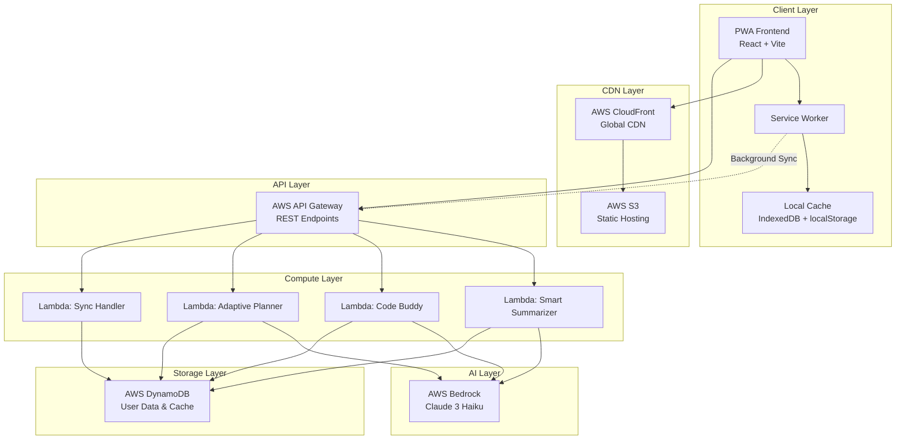

# Design Document: EduCache

## Overview

EduCache is an offline-first Progressive Web App (PWA) that provides AI-powered educational tools for students in low-bandwidth regions. The system employs a serverless AWS architecture with aggressive client-side caching strategies to ensure seamless offline functionality and minimal bandwidth usage.

The application consists of three main components:
1. **Smart Summarizer**: PDF/text processing with AI-generated summaries
2. **Code Buddy**: Error message explanation and coding assistance  
3. **Adaptive Planner**: Personalized daily schedule generation

The architecture prioritizes offline-first design patterns, using service workers for background synchronization and local caching strategies to provide instant access to educational content regardless of connectivity status.

## Architecture

### System Architecture Overview

The EduCache system follows a serverless, offline-first architecture pattern that separates concerns between client-side caching, background synchronization, and cloud-based AI processing.



### Offline-First Strategy

The system implements a comprehensive offline-first approach using multiple caching layers:

**Cache-First Pattern**: Essential application resources (HTML, CSS, JS) are cached aggressively and served from cache first, with network fallback only for updates.

**Network-First with Cache Fallback**: Dynamic content like AI responses use network-first strategy with immediate cache fallback for offline scenarios.

**Background Sync Queue**: All user actions that require network connectivity are queued locally and processed via service worker background sync when connectivity returns.

## Components and Interfaces

### Frontend Components

**PWA Shell Architecture**
- **App Shell**: Core application framework cached for instant loading
- **Content Areas**: Dynamic content areas that load from cache or network
- **Offline Indicators**: Visual feedback for connectivity status and sync progress

**Service Worker Architecture**
- **Cache Manager**: Handles resource caching strategies and cache invalidation
- **Background Sync Manager**: Queues and processes offline actions
- **Push Notification Handler**: Manages study reminders and sync notifications

### Backend Lambda Functions

**Smart Summarizer Lambda**
```typescript
interface SummarizerRequest {
  fileContent: string;
  fileType: 'pdf' | 'text';
  userId: string;
  requestId: string;
}

interface SummarizerResponse {
  summary: string;
  keyPoints: string[];
  processingTime: number;
  cacheKey: string;
}
```

**Code Buddy Lambda**
```typescript
interface CodeBuddyRequest {
  errorMessage: string;
  codeContext?: string;
  language?: string;
  userId: string;
  requestId: string;
}

interface CodeBuddyResponse {
  explanation: string;
  suggestedFixes: string[];
  relatedConcepts: string[];
  cacheKey: string;
}
```

**Adaptive Planner Lambda**
```typescript
interface PlannerRequest {
  availableHours: number;
  subjects: string[];
  preferences: UserPreferences;
  userId: string;
  requestId: string;
}

interface PlannerResponse {
  dailySchedule: ScheduleItem[];
  weeklyGoals: string[];
  adaptationReasons: string[];
  cacheKey: string;
}
```

### API Gateway Endpoints

**REST API Structure**
- `POST /api/v1/summarize` - Smart Summarizer endpoint
- `POST /api/v1/explain-error` - Code Buddy endpoint  
- `POST /api/v1/generate-plan` - Adaptive Planner endpoint
- `POST /api/v1/sync` - Background sync endpoint
- `GET /api/v1/user/{userId}/cache` - Cache retrieval endpoint

**Request/Response Patterns**
All endpoints follow consistent patterns for error handling, caching headers, and low-data mode support. Responses include cache keys for client-side storage and TTL information for cache invalidation.

## Data Models

### Client-Side Storage Schema

**IndexedDB Structure**
```typescript
interface CachedContent {
  id: string;
  type: 'summary' | 'explanation' | 'schedule';
  content: any;
  timestamp: number;
  ttl: number;
  userId: string;
  syncStatus: 'synced' | 'pending' | 'failed';
}

interface QueuedRequest {
  id: string;
  endpoint: string;
  payload: any;
  timestamp: number;
  retryCount: number;
  priority: 'high' | 'medium' | 'low';
}

interface UserPreferences {
  lowDataMode: boolean;
  offlineFirst: boolean;
  syncFrequency: number;
  cacheSize: number;
}
```

**localStorage Schema**
```typescript
interface AppState {
  userId: string;
  lastSync: number;
  offlineMode: boolean;
  preferences: UserPreferences;
  cacheStats: CacheStatistics;
}
```

### DynamoDB Schema

**User Data Table**
```typescript
interface UserRecord {
  PK: string; // USER#{userId}
  SK: string; // PROFILE
  userId: string;
  preferences: UserPreferences;
  createdAt: number;
  lastActive: number;
  totalRequests: number;
}

interface ContentCache {
  PK: string; // USER#{userId}
  SK: string; // CACHE#{contentType}#{hash}
  content: any;
  timestamp: number;
  ttl: number;
  accessCount: number;
}

interface SyncLog {
  PK: string; // USER#{userId}
  SK: string; // SYNC#{timestamp}
  requestId: string;
  operation: string;
  status: 'success' | 'failed';
  timestamp: number;
  errorDetails?: string;
}
```

## Error Handling

### Client-Side Error Handling

**Network Error Recovery**
- Automatic retry with exponential backoff for failed requests
- Graceful degradation to cached content when network is unavailable
- User notification system for persistent connectivity issues

**Cache Error Recovery**
- Automatic cache corruption detection and recovery
- LRU eviction when storage limits are reached
- Fallback to network requests when cache is unavailable

**Service Worker Error Handling**
- Background sync failure recovery with retry limits
- Push notification fallback for critical sync failures
- Automatic service worker update and recovery mechanisms

### Backend Error Handling

**Lambda Function Error Patterns**
- Structured error responses with user-friendly messages
- Automatic retry for transient AWS service failures
- Circuit breaker pattern for AI service unavailability

**AI Service Error Handling**
- Fallback responses for Bedrock service failures
- Request queuing for rate limit scenarios
- Content validation and sanitization for AI responses

## Testing Strategy

### Dual Testing Approach

The testing strategy employs both unit testing and property-based testing to ensure comprehensive coverage:

**Unit Testing Focus**:
- Specific examples demonstrating correct behavior
- Integration points between PWA components and AWS services
- Edge cases and error conditions in offline scenarios
- Service worker lifecycle and caching behavior

**Property-Based Testing Focus**:
- Universal properties that hold across all inputs
- Comprehensive input coverage through randomization
- Cache consistency and synchronization properties
- AI response validation and content integrity

### Property-Based Testing Configuration

**Testing Framework**: Fast-check for TypeScript/JavaScript property-based testing
**Test Configuration**: Minimum 100 iterations per property test
**Test Tagging**: Each test references its corresponding design property using format: `Feature: educache, Property {number}: {property_text}`

### Testing Infrastructure

**Frontend Testing**:
- Jest + React Testing Library for component testing
- Cypress for end-to-end PWA functionality testing
- Service worker testing with workbox-testing utilities

**Backend Testing**:
- AWS SAM local for Lambda function testing
- DynamoDB local for database integration testing
- Bedrock mock services for AI functionality testing

**Performance Testing**:
- Lighthouse CI for PWA performance metrics
- Load testing for Lambda functions under concurrent requests
- Cache performance testing for various storage scenarios

## Correctness Properties

*A property is a characteristic or behavior that should hold true across all valid executions of a system—essentially, a formal statement about what the system should do. Properties serve as the bridge between human-readable specifications and machine-verifiable correctness guarantees.*

### Property 1: Content Processing and AI Response Generation
*For any* valid file upload (PDF or text under 10MB), the Smart Summarizer should successfully extract content, generate an AI summary, and return a properly formatted response with summary and metadata.
**Validates: Requirements 1.1, 2.1, 3.1**

### Property 2: Universal Content Caching
*For any* generated content (summaries, explanations, schedules), the EduCache System should immediately store both the content and associated metadata in Local Cache with proper cache keys and timestamps.
**Validates: Requirements 1.2, 2.4, 3.2, 7.1**

### Property 3: Offline Content Retrieval
*For any* previously cached content, when the system is offline, the EduCache System should retrieve the content from Local Cache and return it with the same structure as online responses.
**Validates: Requirements 1.3, 2.5**

### Property 4: File Size Validation
*For any* file upload exceeding 10MB, the Smart Summarizer should reject the upload and return a descriptive error message without attempting processing.
**Validates: Requirements 1.4**

### Property 5: Offline Request Queuing
*For any* user request when the system is offline or AI Layer is unavailable, the Service Worker should queue the request with proper priority, timestamp, and retry metadata for Background Sync processing.
**Validates: Requirements 1.5, 2.2, 4.3**

### Property 6: Background Sync Processing
*For any* queued requests when connectivity returns, the Service Worker should automatically process all requests in order of priority and timestamp, updating their sync status appropriately.
**Validates: Requirements 2.3, 3.4, 4.4**

### Property 7: Offline System Functionality
*For any* cached application state, when the user goes offline, the EduCache System should continue functioning using cached resources and display appropriate offline indicators.
**Validates: Requirements 4.2, 8.3**

### Property 8: Low Data Mode Response Optimization
*For any* AI request when Low Data Mode is active, the AI Layer should return compressed, text-only responses without rich formatting and with minimized response length.
**Validates: Requirements 5.2, 5.4**

### Property 9: Performance Response Times
*For any* cached content request, the system should respond within 50ms, and for any new AI request with good connectivity, the system should respond within 200ms or display a progress indicator.
**Validates: Requirements 6.1, 6.2, 6.3**

### Property 10: Queue Processing Order
*For any* set of multiple queued requests with different priorities and timestamps, the Background Sync should process them in correct order (priority first, then timestamp) and maintain processing order consistency.
**Validates: Requirements 6.4**

### Property 11: Data Synchronization Timing
*For any* local content changes when connectivity is available, the Service Worker should sync the changes to the backend database within 30 seconds and update sync status accordingly.
**Validates: Requirements 7.2**

### Property 12: Sync Conflict Resolution
*For any* conflicting changes during synchronization, the EduCache System should resolve conflicts using the most recent timestamp and notify the user of the resolution.
**Validates: Requirements 7.3**

### Property 13: LRU Cache Eviction
*For any* cache state approaching storage limits, the EduCache System should implement LRU eviction strategy, removing the least recently used items while preserving cache integrity.
**Validates: Requirements 7.5**

### Property 14: Push Notification Delivery
*For any* sync content availability or application updates, the Service Worker should deliver appropriate push notifications to the user with relevant information.
**Validates: Requirements 8.4, 8.5**

### Property 15: File Validation and Processing
*For any* uploaded file, the Smart Summarizer should validate file type and size before processing, and for PDF files, should extract text content while preserving document structure information.
**Validates: Requirements 9.1, 9.2**

### Property 16: Processing Error Handling
*For any* text extraction failure or processing error, the Smart Summarizer should return descriptive error messages with suggested alternative actions or formats.
**Validates: Requirements 9.3**

### Property 17: Code Content Preservation
*For any* content containing code snippets, the Smart Summarizer should preserve code formatting and syntax highlighting information in the processed output.
**Validates: Requirements 9.5**

### Property 18: Network Error Response
*For any* network request failure or AI Layer error, the EduCache System should display user-friendly error messages with suggested actions or provide fallback responses.
**Validates: Requirements 10.1, 10.2**

### Property 19: Cache Recovery and Data Integrity
*For any* Local Cache corruption or critical system error, the EduCache System should attempt automatic recovery, re-sync essential data, and log error details with user feedback mechanisms.
**Validates: Requirements 10.3, 10.4**

### Property 20: Background Sync Retry Strategy
*For any* repeated Background Sync failures, the Service Worker should implement exponential backoff retry attempts and notify the user when retry limits are exceeded.
**Validates: Requirements 10.5**
